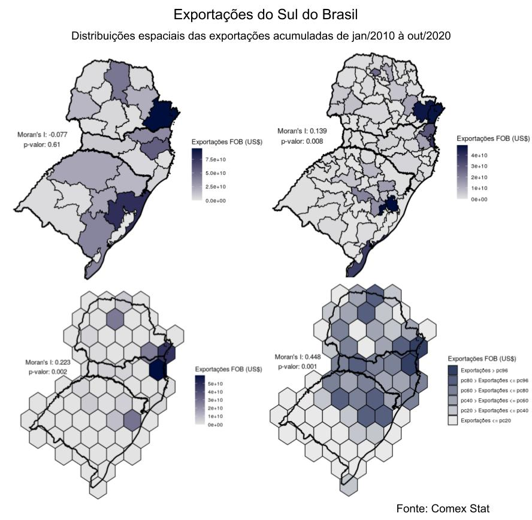

```{r setup, include=FALSE}
library(dplyr)
library(ggplot2)
library(lubridate)
library(sidrar)
knitr::opts_chunk$set(echo = FALSE)
```

# **Os atuais desafios da economia do estado de Santa Catarina**

### Guilherme Viegas

## **Resumo**

Análise espacial da distribuição e complexidade da produção industrial Catarinense e os efeitos da pandemia no mercado de trabalho e no rendimento nominal após as medidas mais restritivas de distanciamento social adotadas pelo governo do estado de Santa Catarina a partir de março de 2020. Exposição das principais estatísticas da indústria Catarinense e as implicações da interrupção do processo produtivo através de indicadores do mercado de trabalho da indústria, assim como do rendimento de empregadores e trabalhadores autônomos no estado Catarinense. Análise exploratória, com orientação analitico-descritiva, de algumas das estatísticas registradas pelos principais instituições de dados do Brasil. Verifica-se impacto severo no mercado de trabalho devido a pandemia de Covid numa economia razoavelmente diversificada e com baixa complexidade. Ao passo que as medidas de distanciamento social estão se abrandando, ainda é necessário reanimar a economia para se minimizar os prejuízos já irreversíveis da pandemia.

**Palavras-chave:** Santa Catarina, Covid-19, Economia, Indústria, Emprego.

## **Abstract**

sadasfsdfsfsdfasfas

**Keyword:** Santa Catarina, Covid-19, Economy, Industry, Employment.

## **1. Introdução**

Caracteristicamente, Santa Catarina é um dos menores estados da Federação Brasileira. Ainda assim, apresenta grande divisão territorial, sendo que, em 2020, é composta por 295 municípios. O elevado número de municípios é consequência de seu processo histórico de formação socioeconômica. Em Santa Catarina, os primeiros três séculos – XV ao XVII – foram caracterizados pela existência de poucos núcleos habitacionais, com reduzida comunicação entre si. Nestas localidades, a atividade econômica estava relacionada à agricultura de subsistência e ao extrativismo. A colonização territorial foi impulsionada somente a partir da imigração no século XIX e apresentou crescimento mais acentuado a partir do século XX. (IBGE, 2020;  GARCEZ, 2017)

Em conjunto à intensificação do processo de ocupação territorial, expandiram-se as atividades econômicas, principalmente a partir das duas últimas décadas do século XIX. A indústria iniciou suas atividades no setor de têxteis e, de modo gradual, ingressou em novos ramos. No decorrer do processo histórico de estruturação produtiva, ocorreu característica diferenciação setorial entre as regiões do território Catarinense. Como exemplo, o setor metalomecânico se desenvolveu na parte norte do estado, ao passo que a agroindústria se consolidava na região oeste. (GOULARTI FILHO, 2007)

O Brasil, todavia, encontra-se historicamente em situação periférica e a reprodução de grandes assimetrias sociais criam bloqueios à inovação e à difusão do progresso técnico que inviabilizam a endogeneização do movimento de transformação capitalista. O subdesenvolvimento no Brasil e em Santa Catarina, portanto, é produto de uma situação histórica que divide o mundo em uma estrutura “centro-periferia”, com características políticas que dificultam o desenvolvimento técnico. (FURTADO, 2005)

Além dessa situação histórica já enraizada nas relações econômicas do Brasil, Santa Catarina apresenta claros sintomas do que a The Economist chamou de Doença Holandesa1, fenômeno caracterizado pela desindustrialização provocada pela entrada de divisas internacionais provenientes da comercialização de uma riqueza natural abundante. A jovem indústria Catarinense, que se consolidou a partir de 1962, perdeu bastante espaço com a abertura comercial e financeira dos 1990, tendo sua indústria enfraquecida gradualmente desde então. (GOULARTI FILHO, 2007; THE ECONOMIST, 2007; STRACK e AZEVEDO, 2012)

Levando em consideração o espaço-produto de Santa Catarina, fica evidente a situação de baixa complexidade de sua rede de produtos. Com exceção do setor metal mecânico, tradicional da região norte Catarinense, os produtos exportados por Santa Catarina são de baixa complexidade, em sua maioria, como carnes de aves, suínos e bovinos, madeira, grãos, têxteis e químicos simples. Tal situação histórica que o estado de Santa Catarina se encontra pode ser denotada pelo que Hidalgo chamou de armadilha da acomodação. (HIDALGO et al, 2007)

Embora seja um dos estados que mais vem se destacando na Federação, Santa Catarina acumulou uma sequência de baixos crescimentos nos últimos anos, junto com os demais estados. Considerando as limitações da estrutura produtiva Catarinense, por fim, o presente artigo busca caracterizar o estado geoeconomicamente e listar os principais desafios da economia catarinense frente as implicações geradas pela pandemia do novo coronavírus em 2020. 


## 2. ...

## 2.1 ...

## 2.2 ...

## 3. Metodologia


##### * Dê mais zoom para detalhes.

```{r rede_dataviva_secex, fig.width=12, fig.height=8, warning=FALSE, message=FALSE}
htmltools::HTML("<iframe width='1000' height='600' src='http://dataviva.info/pt/embed/network/secex/5sc/all/all/hs/?controls=true&year=2017&size=export_val&spotlight=true&rca_scope=bra_rca&color=color' frameborder='0'></iframe>")
```

```{r exp_dataviva_sc, fig.width=12, fig.height=8, warning=FALSE, message=FALSE}

htmltools::HTML("<iframe width='930' height='600' src=http://dataviva.info/pt/I2S3F5 frameborder='0'></iframe>")

```

### continue





```{r sidrar1, fig.width=10, fig.height=6, warning=FALSE, message=FALSE}

# info_sidra(x = "5434")

seqsem <- seq.Date(from = as.Date("2012-02-15"), to = today(), by = "quarter") %>% 
  quarter(., with_year = TRUE) %>% 
  sub(pattern = "\\.", replacement = "0", x = .)

t5434 <- get_sidra(
  x = "5434", 
  period = seqsem, 
  geo = c("State", "Brazil"), 
  geo.filter = list("Brazil" = 1, "State" = c(41, 42, 43))
)

t5434f <- t5434 %>% 
  janitor::clean_names() %>%
  dplyr::select("brasil_e_unidade_da_federacao", "brasil_e_unidade_da_federacao_codigo", "trimestre_codigo", "trimestre", "variavel", "grupamento_de_atividades_no_trabalho_principal_pnadc", "valor", "unidade_de_medida") %>% 
  dplyr::filter(variavel == "Distribuição percentual das pessoas de 14 anos ou mais de idade, ocupadas na semana de referência") %>% 
  dplyr::filter(grupamento_de_atividades_no_trabalho_principal_pnadc == "Indústria geral") # %>% 
  # dplyr::filter(brasil_e_unidade_da_federacao%in%c("Brasil", "Paraná", "Santa Catarina", "Rio Grande do Sul"))
# sapply(t5434f, unique)
t5434f_br <- t5434f %>% 
  dplyr::filter(brasil_e_unidade_da_federacao%in%c("Brasil")) %>% 
  dplyr::rename("valor_br"="valor")
t5434f_pr <- t5434f %>% 
  dplyr::filter(brasil_e_unidade_da_federacao%in%c("Paraná")) %>% 
  dplyr::rename("valor_pr"="valor")
t5434f_sc <- t5434f %>% 
  dplyr::filter(brasil_e_unidade_da_federacao%in%c("Santa Catarina")) %>% 
  dplyr::rename("valor_sc"="valor")
t5434f_rs <- t5434f %>% 
  dplyr::filter(brasil_e_unidade_da_federacao%in%c("Rio Grande do Sul")) %>% 
  dplyr::rename("valor_rs"="valor")

df_pnadc_ind_geral <- left_join(
  t5434f_br, t5434f_pr, 
  by = c("trimestre_codigo", "trimestre", "variavel", "grupamento_de_atividades_no_trabalho_principal_pnadc", "unidade_de_medida")) %>% 
  left_join(
    ., t5434f_sc,
    by = c("trimestre_codigo", "trimestre", "variavel", "grupamento_de_atividades_no_trabalho_principal_pnadc", "unidade_de_medida")) %>% 
  left_join(
    ., t5434f_rs,
    by = c("trimestre_codigo", "trimestre", "variavel", "grupamento_de_atividades_no_trabalho_principal_pnadc", "unidade_de_medida")) %>% 
  dplyr::select("trimestre_codigo", "trimestre", "valor_br", "valor_pr", "valor_sc", "valor_rs")

seqtri <- seq.Date(from = as.Date("2012-02-15"), to = lubridate::today(), by = "quarter")
df_pnadc_ind_geral$trimestre = seqtri[1:nrow(df_pnadc_ind_geral)]

g1 <- ggplot(df_pnadc_ind_geral, aes(x=trimestre))+
  geom_line(aes(y = valor_br, color = "ind_geral_br"))+
  geom_line(aes(y = valor_pr, color = "ind_geral_pr"))+
  geom_line(aes(y = valor_sc, color = "ind_geral_sc"))+
  geom_line(aes(y = valor_rs, color = "ind_geral_rs"))+
  theme_minimal()+
  theme(legend.position="bottom")+
  labs(
    title = "Variação na ocupação dos residentes de Santa Catarina",
    subtitle = "Distribuição percentual das pessoas de 14 anos ou mais de idade, ocupadas na semana de referência",
    y = "Percentual de pessoas ocupadas na Indústria geral",
    x = "Tempo",
    caption = "Fonte: PNADc",
    colour = ""
  ) 

plotly::ggplotly(g1)


```


## 4 Resultados e discussões

## 5. Considerações finais

## Referências